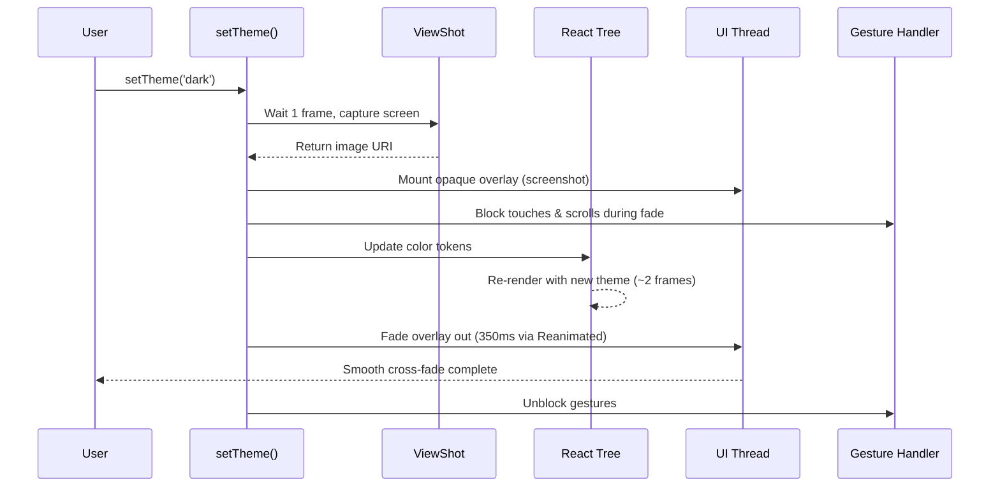

# react-native-theme-transition

[](https://www.npmjs.com/package/react-native-theme-transition)
[](https://bundlephobia.com/package/react-native-theme-transition)


[](https://github.com/marioprieta/react-native-theme-transition/blob/main/LICENSE)

**All-in-one, Expo-first theme solution.** Smooth, animated theme and dark mode transitions for React Native. Expo Go compatible, 100% JS, 60 FPS, powered by Reanimated.

<!-- TODO: Replace with actual demo GIF (600x1300px, 30fps, <5MB) -->
<!-- <p align="center">
  
</p> -->

<!-- TODO: Add Expo Snack link -->
<!-- [](https://snack.expo.dev/...) -->

## Motivation

Implementing smooth, app-wide theme transitions in React Native has historically required custom native iOS and Android modules. This approach alienates Expo Go users, breaks Over-The-Air (OTA) update pipelines, and adds significant maintenance overhead.

`react-native-theme-transition` solves this entirely in the JavaScript and UI thread layers. It captures a screenshot of the current UI, overlays it, switches all colors underneath, then fades out the overlay — achieving flawless 60 FPS cross-fades without ever touching native bridges or requiring custom development clients.

All peer dependencies (`react-native-reanimated`, `react-native-gesture-handler`, `react-native-view-shot`) are already included in Expo SDK 50+.

## Features

- **Expo Go compatible** — zero native code or prebuilds required
- **Full theme management** — Provider, typed hooks, and deep generic inference
- **60 FPS animations** — fade runs entirely on the UI thread via Reanimated
- **System theme sync** — automatically transitions when OS appearance changes
- **React Compiler ready** — all hooks follow the [Rules of React](https://react.dev/reference/rules); no manual `useMemo` or `useCallback` needed. Works with and without the compiler enabled
- **Transition guard** — blocks concurrent transitions, exposes `isTransitioning`
- **Tiny footprint** — ~12 kB compressed, zero runtime dependencies

## Installation

```bash
# Expo (recommended)
npx expo install react-native-theme-transition react-native-reanimated react-native-gesture-handler react-native-view-shot

# React Native CLI
yarn add react-native-theme-transition react-native-reanimated react-native-gesture-handler react-native-view-shot
```

> **Already using Expo SDK 50+?** `react-native-reanimated`, `react-native-gesture-handler`, and `react-native-view-shot` are already included — just install `react-native-theme-transition`.

> **CLI users:** Add `react-native-reanimated/plugin` to your `babel.config.js` and run `npx pod-install` for iOS.

## Quick start

### 1. Define your themes

```ts
// theme.ts
import { createAnimatedTheme } from 'react-native-theme-transition';

const light = {
  background: '#ffffff',
  card:       '#f5f5f5',
  text:       '#000000',
  primary:    '#007AFF',
};

const dark = {
  background: '#000000',
  card:       '#1c1c1e',
  text:       '#ffffff',
  primary:    '#0A84FF',
};

export const { AnimatedThemeProvider, useTheme, useSystemTheme } =
  createAnimatedTheme({
    themes: { light, dark },
    defaultTheme: 'light',
  });

// TypeScript infers everything:
// - Theme names: 'light' | 'dark'
// - Color tokens: 'background' | 'card' | 'text' | 'primary'
```

### 2. Wrap your app

```tsx
import { AnimatedThemeProvider } from './theme';

export default function App() {
  return (
    <AnimatedThemeProvider>
      <MyApp />
    </AnimatedThemeProvider>
  );
}
```

### 3. Use in components

```tsx
import { useTheme } from './theme';

function MyScreen() {
  const { colors, name, setTheme, isTransitioning } = useTheme();

  return (
    <View style={{ flex: 1, backgroundColor: colors.background }}>
      <Text style={{ color: colors.text }}>Current: {name}</Text>
      <Pressable
        onPress={() => setTheme(name === 'light' ? 'dark' : 'light')}
        disabled={isTransitioning}
      >
        <Text style={{ color: colors.primary }}>Toggle theme</Text>
      </Pressable>
    </View>
  );
}
```

## API reference

### `createAnimatedTheme(config)`

Factory function that validates your theme definitions and returns a Provider and hooks with full type inference.

```ts
const { AnimatedThemeProvider, useTheme, useSystemTheme } =
  createAnimatedTheme({
    themes: { light, dark },
    defaultTheme: 'light',
    duration: 350,
    onTransitionEnd: (name) => console.log(`Switched to ${name}`),
  });
```

#### Config options

| Option | Type | Default | Description |
|---|---|---|---|
| `themes` | `Record<string, ThemeDefinition>` | *required* | Object of theme definitions. All themes must share the same color token keys. |
| `defaultTheme` | `keyof themes` | *required* | Theme used on first render. |
| `duration` | `number` | `350` | Fade-out animation duration in milliseconds. |
| `onTransitionEnd` | `(name: string) => void` | — | Called after the fade animation completes. |

> **Theme validation:** At initialization, `createAnimatedTheme` checks that every theme has the exact same keys as `defaultTheme`. If any keys are missing or extra, it throws immediately — catching mismatches during development, not in production.

#### Type inference

You never need to pass generic types manually. TypeScript infers theme names and color tokens directly from your `themes` object:

```ts
const light = { background: '#fff', text: '#000', primary: '#007AFF' };
const dark  = { background: '#000', text: '#fff', primary: '#0A84FF' };

const { useTheme } = createAnimatedTheme({
  themes: { light, dark },
  defaultTheme: 'light',
});

// In any component:
const { colors, name, setTheme } = useTheme();

colors.background // ✅ autocomplete: 'background' | 'text' | 'primary'
colors.foo        // ❌ TypeScript error: Property 'foo' does not exist
name              // type: 'light' | 'dark'
setTheme('dark')  // ✅
setTheme('ocean') // ❌ TypeScript error: Argument not assignable
```

---

### `AnimatedThemeProvider`

Wraps your app tree and provides the theme context.

```tsx
<AnimatedThemeProvider initialTheme="dark">
  <App />
</AnimatedThemeProvider>
```

| Prop | Type | Default | Description |
|---|---|---|---|
| `children` | `ReactNode` | *required* | Your application tree. |
| `initialTheme` | `ThemeName` | Value of `defaultTheme` | Override the starting theme. Useful for restoring a persisted user preference on app launch. |

---

### `useTheme()`

Returns the current theme state and a function to trigger transitions.

```ts
const { colors, name, setTheme, isTransitioning } = useTheme();
```

| Property | Type | Description |
|---|---|---|
| `colors` | `{ [token]: string }` | Current theme's color values, fully typed to your token names. |
| `name` | `ThemeName` | Active theme identifier (e.g. `'light'`, `'dark'`). |
| `setTheme` | `(name, options?) => void` | Triggers a screenshot-overlay transition to the given theme. |
| `isTransitioning` | `boolean` | `true` from when `setTheme` is called until the fade animation ends. |

**Behavior:**
- Calling `setTheme` with the **current** theme name is a no-op.
- Calling it **during** an ongoing transition is silently ignored.
- Use `isTransitioning` to disable toggle buttons or defer expensive renders.

#### `setTheme` options

| Option | Type | Description |
|---|---|---|
| `onCaptured` | `() => void` | Called once the screenshot overlay is mounted and visible. At this point the user sees a frozen image of the old theme — ideal for triggering haptic feedback or logging analytics. |

```ts
setTheme('dark', {
  onCaptured: () => {
    // The screenshot is now visible. Safe to trigger side effects.
    Haptics.impactAsync(Haptics.ImpactFeedbackStyle.Medium);
  },
});
```

---

### `useSystemTheme(enabled?, mapping?)`

Subscribes to OS appearance changes and triggers animated transitions automatically.

```ts
// Follow system theme (assumes your themes are named 'light' and 'dark')
useSystemTheme(true);

// Conditionally enable based on user preference
useSystemTheme(colorMode === 'system');

// Map OS schemes to custom theme names
useSystemTheme(true, { light: 'sunrise', dark: 'midnight' });
```

| Param | Type | Default | Description |
|---|---|---|---|
| `enabled` | `boolean` | `undefined` | When `true`, subscribes to `Appearance` changes. When `false` or omitted, the listener is removed. |
| `mapping` | `{ light?: ThemeName, dark?: ThemeName }` | — | Maps OS color schemes to your theme names. If omitted, assumes your themes are named `'light'` and `'dark'`. |

> Must be called inside `AnimatedThemeProvider`. Calls `setTheme` internally, so transitions are animated just like manual switches.

### Exported types

For advanced TypeScript usage, these types are available as named imports:

```ts
import type {
  ThemeDefinition,       // Record<string, string> — shape of a single theme
  AnimatedThemeConfig,   // Config object for createAnimatedTheme
  AnimatedThemeAPI,      // Return type of createAnimatedTheme
  SetThemeOptions,       // Options for setTheme ({ onCaptured })
  ThemeNames,            // Union of theme name strings
  TokenNames,            // Union of color token strings
} from 'react-native-theme-transition';
```

---

## Recipes

### Haptic feedback on theme switch

```tsx
import * as Haptics from 'expo-haptics';

setTheme('dark', {
  onCaptured: () => Haptics.impactAsync(Haptics.ImpactFeedbackStyle.Medium),
});
```

### Integration with Zustand

```tsx
function ThemeBridge() {
  const colorMode = useThemeStore((s) => s.colorMode);
  const { setTheme } = useTheme();

  useSystemTheme(colorMode === 'system');

  useEffect(() => {
    if (colorMode !== 'system') setTheme(colorMode);
  }, [colorMode, setTheme]);

  return null;
}
```

### React Navigation theme sync

```tsx
import { useTheme } from './theme';

function App() {
  const { colors, name } = useTheme();

  const navigationTheme = {
    dark: name === 'dark',
    colors: {
      primary: colors.primary,
      background: colors.background,
      card: colors.card,
      text: colors.text,
      border: colors.card,
      notification: colors.primary,
    },
  };

  return (
    <NavigationContainer theme={navigationTheme}>
      {/* ... */}
    </NavigationContainer>
  );
}
```

## Comparison

| Feature | react-native-theme-transition | react-native-theme-switch-animation |
|---|:---:|:---:|
| Expo Go support | ✅ | ❌ Requires prebuild |
| Execution | Pure JS / Reanimated UI thread | Native modules (Java/ObjC) |
| Theme state management | ✅ Provider + typed hooks | ❌ Bring your own |
| TypeScript generics | ✅ Deep inference for tokens | ⚠️ Basic typings |
| System theme listener | ✅ Built-in (`useSystemTheme`) | ❌ Not included |
| React Compiler | ✅ Compatible | ❌ |
| New Architecture (Fabric) | ✅ | ✅ |

## How it works



1. `setTheme('dark')` is called
2. Waits one frame for pending renders to commit
3. Captures a full-screen screenshot via `react-native-view-shot`
4. Shows the screenshot as an opaque overlay
5. Blocks touch and scroll via `react-native-gesture-handler` to prevent interaction with the invisible underlying UI
6. Switches all color tokens instantly underneath
7. Waits two frames for React to re-render with new colors
8. Fades the overlay out (default 350ms) on the UI thread via `react-native-reanimated`
9. Unblocks gestures once the fade completes

The screenshot is captured **before** the color switch, so the overlay is visually identical to the current screen. When it fades, it reveals the fully re-rendered new theme — no partial states, no flashes.

## Known limitations

- **Gesture blocking during transitions** — During the fade animation (default 350ms), an invisible layer blocks touch and scroll events. This is an intentional architectural decision: since the user sees a static screenshot overlay, allowing scroll would cause the underlying UI to move invisibly, creating visual dissonance when the overlay fades. This brief interruption mirrors standard iOS and Android OS-level transition behavior and is imperceptible in normal usage.

- **Sequential transitions only** — If `setTheme` is called during an ongoing transition, the call is silently ignored. Use `isTransitioning` to disable toggle buttons during this window.

## Requirements

- React Native >= 0.72
- react-native-reanimated >= 3.0.0
- react-native-gesture-handler >= 2.0.0
- react-native-view-shot >= 3.0.0

## Contributing

Contributions are welcome! Please read the [contributing guide](./CONTRIBUTING.md) and open an issue first to discuss what you'd like to change.

## License

[MIT](./LICENSE) © [Mario Prieta](https://github.com/marioprieta)
