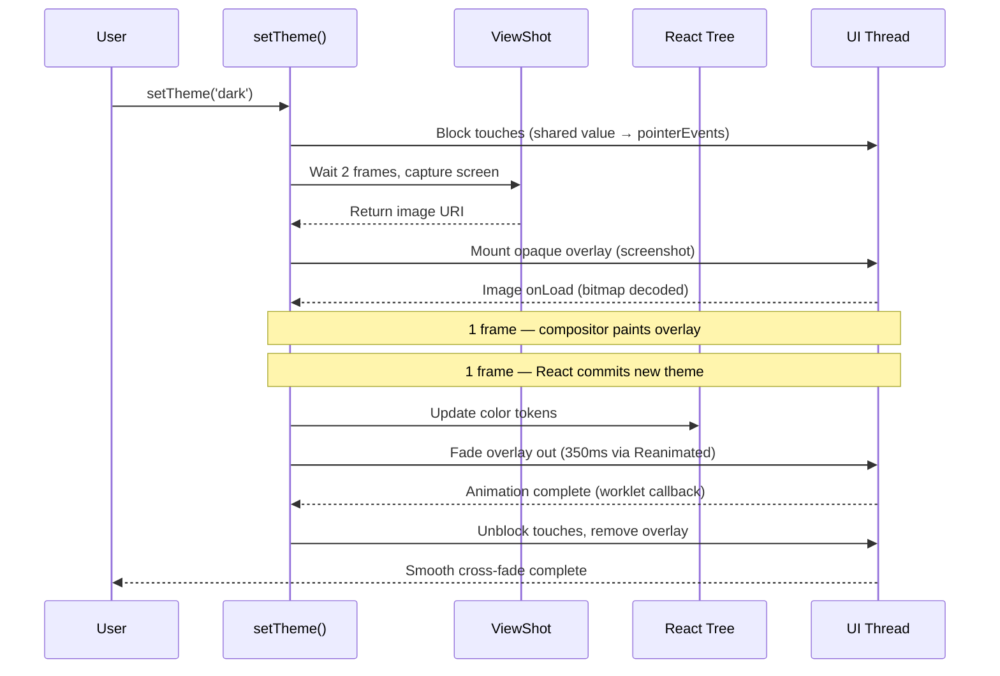

The library captures a full-screen screenshot of the current UI, displays it as an
opaque overlay, switches all color tokens underneath, then fades the overlay out on
the native UI thread via Reanimated. The screenshot is taken **before** the color
switch, so the transition is seamless.

## Sequence diagram



## Step by step

1. `setTheme('dark')` is called
2. Touches blocked instantly via a Reanimated shared value (no React re-render needed)
3. Two frames wait for the JS → Shadow Tree → Native UI pipeline to fully paint pending state changes
4. Full-screen screenshot captured via `react-native-view-shot`
5. Screenshot displayed as an opaque overlay
6. `Image.onLoad` confirms the bitmap is decoded (event-based, not frame-guessing)
7. One frame for the compositor to paint the overlay on screen
8. Color tokens switched underneath
9. One frame for React to commit the new theme under the still-opaque overlay
10. Overlay fades out on the UI thread via `react-native-reanimated` — the RN repaint pipeline completes during the first frames of the fade, when the overlay is still near-opaque
11. Touches unblocked and overlay removed once the fade completes via a worklet callback (`react-native-worklets`)

## The frame pipeline

React Native renders in a pipeline:

```
JS Thread → Shadow Tree → Native UI Thread
```

Each stage takes ~1 frame (~16ms at 60Hz, ~8ms at 120Hz). The library uses `waitFrames`
to ensure each stage completes before proceeding:

- **2 frames before capture**: ensures pending state changes are fully painted
- **1 frame after overlay mount**: ensures the compositor has painted the overlay
- **1 frame after color switch**: ensures React has committed the new theme

## Why screenshots?

Other approaches to theme transitions require native modules (custom iOS/Android code)
to manipulate the view hierarchy directly. The screenshot approach works entirely in JS
+ Reanimated, making it compatible with Expo Go and any React Native setup.

The trade-off is that the overlay is static — dynamic content (videos, animations)
will appear frozen during the ~350ms fade.
