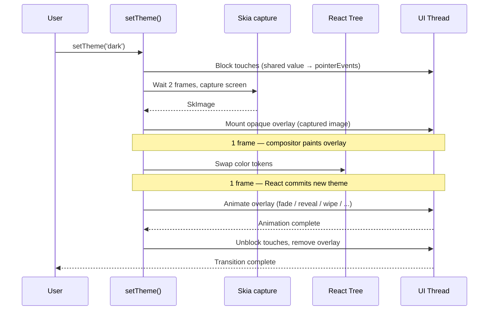

The library captures a full-screen snapshot of the current UI via Skia,
displays it as an opaque overlay, switches all color tokens underneath,
then animates the overlay away on the native UI thread via Reanimated.
The snapshot is taken while the **old** colors are still visible, so the
new theme is fully committed under the overlay before the animation starts.

## Sequence diagram


```mermaid
sequenceDiagram
    participant User
    participant Hook as setTheme()
    participant Skia as Skia capture
    participant React as React Tree
    participant UI as UI Thread

    User->>Hook: setTheme('dark')
    Hook->>UI: Block touches (shared value → pointerEvents)
    Hook->>Skia: Wait 2 frames, capture screen
    Skia-->>Hook: SkImage
    Hook->>UI: Mount opaque overlay (captured image)
    Note over Hook,UI: 1 frame — compositor paints overlay
    Hook->>React: Swap color tokens
    Note over Hook,UI: 1 frame — React commits new theme
    Hook->>UI: Animate overlay (fade / reveal / wipe / ...)
    UI-->>Hook: Animation complete
    Hook->>UI: Unblock touches, remove overlay
    UI-->>User: Transition complete
```

## Step by step

1. `setTheme('dark')` (or `select('dark')`) is called.
2. Touches are blocked instantly via a Reanimated shared value — no React
   re-render needed.
3. The library waits 2 frames for the JS → Shadow Tree → Native UI pipeline
   to fully paint any pending state changes (this is why `select()` defers
   by one frame — so the pressed highlight ends up in the screenshot).
4. A full-screen snapshot is captured via `@shopify/react-native-skia`.
5. The snapshot is mounted as an opaque overlay on top of everything.
6. One frame for the compositor to paint the overlay on screen.
7. Color tokens are swapped underneath — the provider updates its React
   context, all children re-render with the new colors while the overlay
   is still opaque.
8. One frame for React to commit the new theme under the still-opaque overlay.
9. The overlay animates according to the selected transition style — a fade,
   an expanding circle, a wipe, a shape clip, a pixelize/dissolve shader, etc.
   All styles run on the UI thread via Reanimated.
10. Touches are unblocked and the overlay is removed when the animation ends.

> A **worklet** is a small JS function that Reanimated runs directly on the
> UI thread — the library uses one to react to animation completion without
> a JS-thread round trip.

## The frame pipeline

React Native renders in a pipeline:

```
JS Thread → Shadow Tree → Native UI Thread
```

Each stage takes ~1 frame (~16ms at 60Hz, ~8ms at 120Hz). The library uses
`waitFrames` to ensure each stage completes before proceeding:

- **2 frames before capture**: ensures pending state changes are fully painted
- **1 frame after overlay mount**: ensures the compositor has painted the overlay
- **1 frame after color swap**: ensures React has committed the new theme

The animation duration is independent of frame rate and runs on the UI thread,
matching the device's native refresh rate (60–120 FPS).

## Why screenshots?

Other approaches to theme transitions require custom iOS/Android code to
manipulate the view hierarchy directly. The snapshot approach works entirely
in JS + Reanimated + Skia, making it compatible with Expo Go and any React
Native setup.

The trade-off is that the overlay is a still image regardless of transition
type — `fade`, `circularReveal`, `wipe`, `pixelize`, and every other style
animate this same bitmap. Any dynamic content behind it (videos, Lottie,
camera preview, live counters) will appear frozen for the transition's
`duration`.

## Reduced motion

When the OS has Reduce Motion enabled and `reduceMotion: true` is set in
config (the default), the library skips the snapshot / overlay step entirely
and switches colors instantly. None of the transition callbacks fire in that
path — only `onThemeChange`.

Read the current value in your own UI with the exported `useReducedMotion()`
hook if you want to adjust unrelated animations to match.
