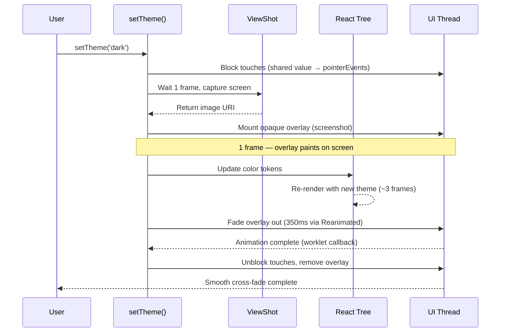

# How it works

## Sequence diagram

## Step by step

1. `setTheme('dark')` is called
2. Touches blocked instantly via a Reanimated shared value (no React re-render needed)
3. One frame wait for pending renders to commit
4. Full-screen screenshot captured via `react-native-view-shot`
5. Screenshot displayed as an opaque overlay
6. One frame wait for the overlay to paint on the native UI thread
7. Color tokens switched underneath
8. Three more frames for React to re-render with new colors
9. Overlay fades out on the UI thread via `react-native-reanimated`
10. Touches unblocked and overlay removed once the fade completes via a worklet callback (`react-native-worklets`)

The screenshot is captured **before** the color switch, so the overlay looks identical to the current screen. When it fades, it reveals the fully re-rendered new theme. No partial states, no flashes.
